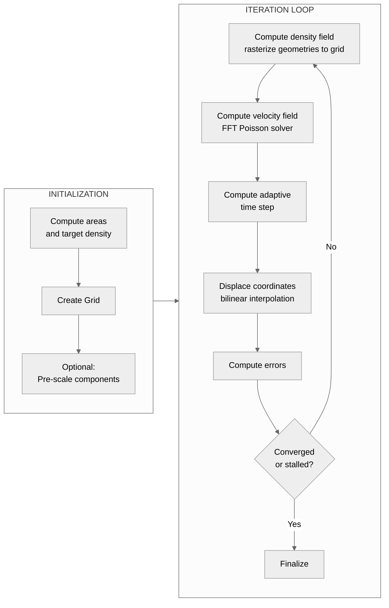

# Flow Cartogram Algorithm

## Overview

The flow cartogram algorithm deforms polygon geometries so that each region's area becomes proportional to an associated data value while maintaining spatial contiguity and approximate shape recognition. The approach follows Gastner and Newman's diffusion-based density-equalizing map method \[1\]: high-density regions expand and low-density regions contract until all regions reach a uniform equilibrium density.

The algorithm is implemented in `morph_geometries()` ([algorithm.py](https://github.com/fkloosterman/carto-flow/blob/main/src/carto_flow/flow_cartogram/algorithm.py)). The high-level API is `CartogramWorkflow` ([workflow.py](https://github.com/fkloosterman/carto-flow/blob/main/src/carto_flow/flow_cartogram/workflow.py)).

## Mathematical Foundation

### Equilibrium Condition

Given $n$ regions with data values $v_1, \ldots, v_n$ and current areas $a_1, \ldots, a_n$, the target is for every region to have the same density:

$$
\rho^* = \frac{\sum_i v_i}{\sum_i a_i}
$$

At convergence, each region has area:

$$
a_i^{\text{final}} = \frac{v_i}{\rho^*}
$$

### Error Metric

Area error is measured in log₂ space:

$$
e_i = \log_2\!\left(\frac{a_i^{\text{current}}}{a_i^{\text{target}}}\right)
$$

This representation is symmetric: $e_i = +1$ means the region is twice as large as its target; $e_i = -1$ means half as large. The equivalent percentage error is:

$$
e_i^{\%} = \operatorname{sign}(e_i) \cdot \left(2^{|e_i|} - 1\right) \cdot 100
$$

---

## Computational Pipeline

### Initialization

1. Compute initial polygon areas and target density $\rho^*$.
2. Build a `Grid` covering the input bounds (with optional margin).
3. Optionally pre-scale connected components (`prescale_components=True`): each group of geometrically adjacent polygons is uniformly scaled to its target combined area before morphing begins. This reduces over-deformation of outer polygons. See [Reduce Boundary Distortion](../how-to/reduce-boundary-distortion.ipynb).

### Per-Iteration Steps

#### 1. Density Field

Each polygon is rasterized onto the grid: cells whose centers fall inside polygon $i$ receive density $\rho_i = v_i / a_i$. Cells outside all polygons are filled with the global mean density $\rho^*$.

Rasterization uses `shapely.contains_xy()` for vectorized point-in-polygon tests. The resulting field can be transformed by a `DensityModulator` before the velocity solve (see [Modulators](#density-and-velocity-modulators) below).

By default, the density field is recomputed every `recompute_every` iterations (default: 10). Between recomputations the same field is reused, which is valid because the velocity pattern changes slowly near convergence.

#### 2. Velocity Field

The velocity field is computed by solving a Poisson equation in the frequency domain \[1\]. The normalized density:

$$
\tilde{\rho} = \frac{\rho - \bar{\rho}}{\bar{\rho}}
$$

is the source term. The Poisson equation $\nabla^2 \phi = \tilde{\rho}$ is solved spectrally:

$$
\hat{\phi}(k_x, k_y) = -\frac{\hat{\tilde{\rho}}(k_x, k_y)}{\dfrac{k_x^2}{D_x} + \dfrac{k_y^2}{D_y}}
$$

where $k_x = 2\pi \cdot \text{fftfreq}(n_x, \Delta x)$, $k_y = 2\pi \cdot \text{fftfreq}(n_y, \Delta y)$, and $D_x$, $D_y$ are anisotropy parameters that scale flow in each axis direction. The $k=0$ component is set to zero (imposing zero mean velocity). The velocity components follow from the potential:

$$
v_x = \operatorname{Re}\!\left(\mathcal{F}^{-1}\!\left[i k_x \hat{\phi}\right]\right), \qquad
v_y = \operatorname{Re}\!\left(\mathcal{F}^{-1}\!\left[i k_y \hat{\phi}\right]\right)
$$

The velocity field is then normalized by the maximum velocity from the first iteration so that time steps remain consistent across iterations.

A `VelocityModulator` can modify the field after computation (see [Modulators](#density-and-velocity-modulators)).

Three implementations are available: `compute_velocity_anisotropic()` (NumPy FFT, reference), `compute_velocity_anisotropic_rfft()` (real FFT with cached wavenumbers), and `VelocityComputerFFTW` (pre-allocated arrays, FFTW plans, SIMD-aligned memory).

#### 3. Adaptive Time Step

$$
\Delta t = dt \cdot \frac{\min(\Delta x, \Delta y)}{\max(|v_x|, |v_y|)}
$$

The factor $dt \in (0, 1]$ is set in `MorphOptions`. This CFL-like expression ensures that no vertex moves more than one cell width per iteration, preventing coordinate overshooting.

#### 4. Displacement

Every polygon vertex (and any provided landmark or coordinate set) is displaced by bilinear interpolation of the velocity field:

$$
\mathbf{p}^{\text{new}} = \mathbf{p}^{\text{old}} + \Delta t \cdot \mathbf{v}(\mathbf{p}^{\text{old}})
$$

Interpolation is implemented as a Numba JIT-compiled, parallelized function that computes cell indices directly (no `searchsorted` overhead).

The `coords` parameter supports three formats—$(N, 2)$ point arrays, $(X, Y)$ meshgrid tuples, and $(M, N, 2)$ mesh arrays—which are converted internally and restored to the original format after displacement.

#### 5. Error Computation and Termination

After displacement, polygon areas are recomputed from the deformed vertices and per-geometry log₂ errors $e_i$ are calculated. The algorithm terminates when:

- **Convergence**: $\bar{e} < \log_2(1 + \tau_{\text{mean}})$ and $\max e_i < \log_2(1 + \tau_{\text{max}})$, where $\tau_{\text{mean}}$ and $\tau_{\text{max}}$ are the `mean_tol` and `max_tol` parameters (expressed as fractions, e.g. 0.05 for 5%).
- **Stall**: The maximum error increases for `stall_patience` consecutive iterations.
- **Iteration limit**: `n_iter` iterations have been completed.

Scalar error metrics are recorded in `ConvergenceHistory` at every iteration. Full `CartogramSnapshot` objects (including geometries) are saved at every `snapshot_every` iterations, and always at the final iteration regardless of the termination reason.

---

## Grid

`Grid` ([grid.py](https://github.com/fkloosterman/carto-flow/blob/main/src/carto_flow/flow_cartogram/grid.py)) defines the spatial discretization for the FFT computation.

| Constructor parameter | Type | Description |
|---|---|---|
| `bounds` | `(xmin, ymin, xmax, ymax)` | Spatial extent |
| `size` | `int` or `(sx, sy)` | Grid points on longest axis, or explicit size |
| `margin` | `float` | Fractional padding added around bounds |
| `square` | `bool` | Enforce equal cell spacing ($\Delta x = \Delta y$) |

Cell centers, edges, and spacings are computed lazily on first access and cached as properties.

### Multi-Resolution Grids

`build_multilevel_grids(min_resolution, levels, margin, square)` returns a dyadic hierarchy of `Grid` objects. Each successive level doubles the resolution on the longest axis. The coarsest grid has `min_resolution` points; there are `levels` grids total.

This hierarchy is used by `CartogramWorkflow.morph_multiresolution()` to run morphing sequentially from coarse to fine, with each level starting from the geometry produced by the previous level.

---

## Density and Velocity Modulators

The algorithm exposes two extension points for modifying the density and velocity fields without altering the core loop:

- **`DensityModulator`**: transforms the density grid after rasterization. Multiple modulators can be chained with `+`. The `density_mod` parameter in `MorphOptions` accepts a modulator or chain.
- **`VelocityModulator`**: transforms the velocity field after the FFT solve. Supplied via the `anisotropy` parameter in `MorphOptions`.

Both are defined as abstract base classes in [anisotropy.py](https://github.com/fkloosterman/carto-flow/blob/main/src/carto_flow/flow_cartogram/anisotropy.py). The primary use case is reducing outer-boundary distortion: for example, `DensityBorderExtension` inpaints interior densities outward so the density gradient at the boundary is less abrupt. See the [Reduce Boundary Distortion](../how-to/reduce-boundary-distortion.ipynb) how-to for practical guidance.

---

## MorphOptions

`MorphOptions` ([options.py](https://github.com/fkloosterman/carto-flow/blob/main/src/carto_flow/flow_cartogram/options.py)) is a validated dataclass that controls all algorithm parameters.

| Parameter | Default | Description |
|---|---|---|
| `dt` | 1.0 | Time step scalar controlling displacement magnitude per iteration |
| `n_iter` | 500 | Maximum iterations |
| `recompute_every` | 10 | Recompute density/velocity every N iterations |
| `snapshot_every` | `None` | Save full snapshot every N iterations; `None` = final only |
| `mean_tol` | 0.05 | Convergence threshold for mean area error (fraction) |
| `max_tol` | 0.1 | Convergence threshold for max area error (fraction) |
| `stall_patience` | 5 | Stall after N consecutive iterations of increasing max error; `None` = disabled |
| `grid` | `None` | Pre-constructed `Grid`; takes precedence over size/margin/square |
| `grid_size` | 100 | Grid points on longest axis |
| `grid_margin` | 0.5 | Fractional padding around input bounds |
| `grid_square` | `True` | Enforce square cells |
| `Dx`, `Dy` | 1.0 | Anisotropy factors for the FFT solver |
| `anisotropy` | `None` | `VelocityModulator` applied after the FFT solve |
| `density_mod` | `None` | `DensityModulator` applied after rasterization |
| `area_scale` | 1.0 | Multiplier applied to polygon areas before density computation |
| `prescale_components` | `False` | Pre-scale connected components to target area |
| `save_internals` | `False` | Save density/velocity grids in `Cartogram.internals` |

Three preset factory methods are available: `MorphOptions.preset_fast()`, `.preset_balanced()`, and `.preset_high_quality()`.

---

## Limitations

**Periodic boundary conditions.** The FFT solver assumes periodic boundary conditions. This means the velocity field wraps at grid edges, which can produce artifacts if input geometries are close to the grid boundary. Mitigate by setting `grid_margin` to add sufficient padding (default 0.5 = 50% of the bounding box on each side).

**Outer-boundary distortion.** Exterior cells are assigned mean density, creating a sharp density step at the boundary of the data region. Outer polygons tend to expand more than expected. This is partly mitigated by `prescale_components` and by density modulators such as `DensityBorderExtension`.

**Grid resolution trade-off.** Higher grid resolution produces a smoother, more accurate velocity field but increases computation time. The density field is only as detailed as the grid; very thin or small polygons may not rasterize correctly at low resolution.

**Iterative approximation.** The algorithm does not solve the equilibrium condition exactly in one step. Convergence is reached after many iterations, and the result depends on `dt`, `n_iter`, `mean_tol`, and `max_tol`. Tight tolerances may require many iterations; loose tolerances may leave visible residual errors.

---

## References

\[1\] M. T. Gastner and M. E. J. Newman, "Diffusion-based method for producing density-equalizing maps," *Proc. Natl. Acad. Sci. U.S.A.*, vol. 101, no. 20, pp. 7499–7504, 2004.
DOI: [10.1073/pnas.0400280101](https://doi.org/10.1073/pnas.0400280101) · arXiv: [physics/0401102](https://arxiv.org/abs/physics/0401102)
Reference implementation (C): [https://websites.umich.edu/~mejn/cart/](https://websites.umich.edu/~mejn/cart/)

\[2\] M. T. Gastner, V. Seguy, and P. More, "Fast flow-based algorithm for creating density-equalizing map projections," *Proc. Natl. Acad. Sci. U.S.A.*, vol. 115, no. 10, pp. E2156–E2164, 2018.
DOI: [10.1073/pnas.1712674115](https://doi.org/10.1073/pnas.1712674115)
Reference implementation (C): [github.com/Flow-Based-Cartograms/go\_cart](https://github.com/Flow-Based-Cartograms/go_cart)

carto-flow implements the method of \[1\]. The 2018 algorithm \[2\] replaces the iterative density rasterization with a prescribed linear density path `ρ(t) = (1-t)·ρ₀ + t·ρ̄`, which eliminates re-rasterization at each step and is approximately 40× faster in practice.
