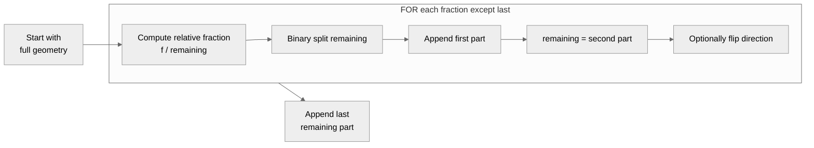

# Proportional Cartogram

## Overview

The proportional cartogram submodule provides two geometric operations for dividing polygon areas according to numeric fractions: **splitting** partitions a polygon into N disjoint, non-overlapping parts using planar cuts; **shrinking** peels a polygon into N concentric shells using negative buffering. Both operations accept a geometry and a list of fractions that sum to 1, and both locate the dividing boundary numerically via root finding. `partition_geometries()` applies either operation to all rows of a GeoDataFrame.

Relevant source files: [splitting.py](https://github.com/fkloosterman/carto-flow/blob/main/src/carto_flow/proportional_cartogram/splitting.py), [shrinking.py](https://github.com/fkloosterman/carto-flow/blob/main/src/carto_flow/proportional_cartogram/shrinking.py), [partition.py](https://github.com/fkloosterman/carto-flow/blob/main/src/carto_flow/proportional_cartogram/partition.py).

---

## Splitting

### Overview

`split(geom, fractions, ...)` divides a polygon into N disjoint parts each with a specified area fraction. The parts are placed adjacent to each other and together cover the original geometry exactly.

### Core Mechanism: Binary Split via Root Finding

Every N-way split is built from repeated binary splits. A binary split divides a geometry into two parts at a target fraction $f$ by finding the position of an axis-aligned cut line:

$$
\text{area}\!\left(\text{geom} \cap B_L(x)\right) - f \cdot \text{area}(\text{geom}) = 0
$$

where $B_L(x)$ is the bounding box to the left of cut position $x$. The domain is $[x_{\min}, x_{\max}]$ for a vertical cut or $[y_{\min}, y_{\max}]$ for a horizontal cut. The root is found with `scipy.optimize.root_scalar()` (Brent's method). The intersection uses Shapely bounding-box clipping rather than an explicit polygon cut, which is robust for concave shapes and multipolygons.

### Sequential Strategy

The default `strategy='sequential'` carves parts one by one from the remaining geometry:

At each step the fraction is expressed relative to the current remaining area: `relative_frac = target_frac / remaining_frac`. Direction alternation (`alternate=True`, default) flips the cut axis between vertical and horizontal at each step, producing a staircase pattern instead of parallel strips.

### Treemap Strategy

`strategy='treemap'` uses recursive binary partitioning that mimics a treemap layout.

**Building the tree**: Given N fractions, find the index where the cumulative sum is closest to half the total. Fractions below that index go to the left subtree; the rest go to the right. Recurse on each side with their sub-fractions and alternated direction.

**Applying the tree**: At each node, split the geometry at the ratio `left_sum / total`. Recurse on the left half with `left_fracs / left_sum` and the right half with `right_fracs / right_sum`.

**Fixed-structure variant**: When `treemap_reference` is provided, the tree structure is built once from the reference fractions and reused across all geometries. This guarantees that fraction index $i$ occupies the same relative spatial position in every geometry — important for consistent visual encoding in multi-geometry maps.

### Parameters

| Parameter | Default | Description |
|---|---|---|
| `fractions` | required | Area fractions; a single float gives a binary split, a list gives N parts |
| `direction` | `'vertical'` | Initial cut direction (`'vertical'` or `'horizontal'`) |
| `alternate` | `True` | (Sequential only) Flip cut direction at each step |
| `strategy` | `'sequential'` | `'sequential'` or `'treemap'` |
| `tol` | `0.01` | Absolute area tolerance for root finding |
| `treemap_reference` | `None` | (Treemap only) Reference fractions for a fixed spatial layout |

### Limitations

- Splits are always axis-aligned. Non-rectangular shapes may produce visually irregular strips.
- Sequential mode can produce very thin slivers when many small fractions are specified.
- The treemap balancing is based on cumulative-sum midpoints, not the geometry's spatial extent; heavily skewed fraction distributions may produce odd layouts.
- Root finding requires SciPy.

---

## Shrinking

### Overview

`shrink(geom, fractions, ...)` creates N concentric parts by repeatedly applying a negative buffer (morphological erosion). Parts are returned **core-first**: the first element is the innermost piece; subsequent elements are shells around it. The fractions can take any non-negative values summing to 1 — the core is not necessarily the smallest part.

### Core Mechanism: Negative Buffering via Root Finding

A single shrink-to-fraction $f$ is implemented by finding the negative buffer distance $d < 0$ that achieves the target area:

$$
\text{area}(\text{geom.buffer}(d)) - f \cdot \text{area}(\text{geom}) = 0
$$

The bracket is $[-\frac{1}{2}\ell, \, 0]$ where $\ell = \min(\text{width}, \text{height})$ of the bounding box, which prevents buffering past the centroid. The initial guess is:

$$
d_0 \approx -\frac{\ell}{2}\left(1 - \sqrt{f}\right)
$$

The root is found with `scipy.optimize.root_scalar()`. The shell is the set difference between the original and the shrunken geometry.

### Multi-Fraction: Concentric Shell Peeling

For N fractions, shells are peeled from the outside inward:

| Step | Operation | Produces |
|---|---|---|
| 1 | Shrink geometry to `1 - frac_outermost` of original | Outermost shell = difference |
| 2 | Shrink result to `1 - frac_next` of current | Next shell = difference |
| … | … | … |
| N−1 | Last shrink | Second-innermost shell |
| — | Remaining geometry | Core |

The accumulated parts are reversed before returning, so the output is core-first: `[core, inner_shell, …, outer_shell]`.

### Mode: Area vs. Shell

- `mode='area'` (default): fractions are direct area ratios.
- `mode='shell'`: each fraction $f$ is squared before use — `f → f²`. This maps a linear "thickness" intuition to area: a shell fraction of 0.5 corresponds to 25% of the total area, consistent with how circular rings scale.

### Optional Simplification

The `simplify` parameter applies `shapely.coverage_simplify` (Visvalingam-Whyatt) to the input geometry before buffering. Simplification can reduce numerical artifacts that arise from buffering highly detailed boundaries, at the cost of geometric accuracy.

### Parameters

| Parameter | Default | Description |
|---|---|---|
| `fractions` | required | Area fractions; a single float gives `[core, shell]`; a list gives N parts core-first |
| `simplify` | `None` | Visvalingam-Whyatt tolerance applied before shrinking; `None` = no simplification |
| `mode` | `'area'` | `'area'` for direct area fractions; `'shell'` to square fractions |
| `tol` | `0.05` | Relative tolerance for root finding |

### Limitations

- **Disconnected inner parts**: For non-convex geometries the negative buffer can shrink past a geometric "pinch point", splitting the core or an inner shell into a `MultiPolygon`. This is a property of Minkowski erosion and cannot be avoided for all shapes.
- Negative buffering can produce self-intersections or degenerate geometries for highly concave shapes with sharp re-entrant angles.
- Very small fractions (near 0) can produce near-empty geometries.

---

## Shrinking vs. Simple Scaling

An alternative to negative buffering is to scale the original polygon down around its centroid to the target area fraction. Scaling is fast and straightforward, but has a critical drawback: the scaled shape is not guaranteed to stay within the boundary of the original polygon. For non-convex or irregularly shaped geometries, protrusions of the scaled shape can extend outside the original boundary, which is geometrically incorrect for a cartogram that must respect geographic region boundaries. Negative buffering does not have this problem: the buffer operation always produces a result that is a subset of the original geometry.

---

## Batch Processing: `partition_geometries()`

`partition_geometries(gdf, columns, method, normalization, ...)` applies either `split` or `shrink` to every geometry in a GeoDataFrame and returns a new GeoDataFrame with one geometry column per input column.

### Normalization Modes

The normalization mode controls how column values are converted to fractions:

| Mode | Formula | Each row fills completely? |
|---|---|---|
| `'row'` | `value / row_sum` | Always |
| `'sum'` | `value / global_sum` | Only when row_sum = global_sum |
| `'maximum'` | `value / max_row_sum` | Only the row with the maximum sum |
| `None` | Values used directly | Only if row sums equal 1.0 |

When the row fractions sum to less than 1.0, the remainder is exposed as a `geometry_complement` column. The output contains geometry columns named `geometry_<colname>` for each input column, plus `geometry_complement` when present.

`n_jobs` controls parallelization via joblib: `1` = sequential, `-1` = all available cores.

---

## Splitting vs. Shrinking

| | Splitting | Shrinking |
|---|---|---|
| **Part relationship** | Disjoint, non-overlapping | Concentric, nested |
| **Visual pattern** | Strips (sequential) or treemap grid | Concentric rings |
| **Output order** | Matches input fraction order | Core-first (innermost to outermost) |
| **Suitable for** | Categorical composition, ranked treemaps | Hierarchical data, nested categories |
| **Limitations** | Axis-aligned cuts only; thin slivers | Inner parts may split; scaling alternative not available |
