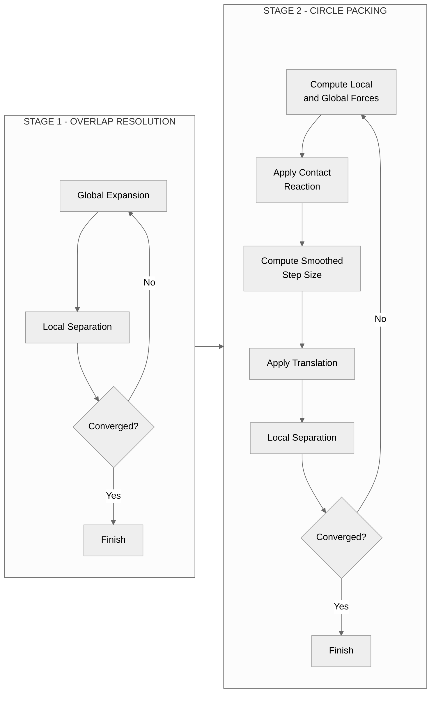
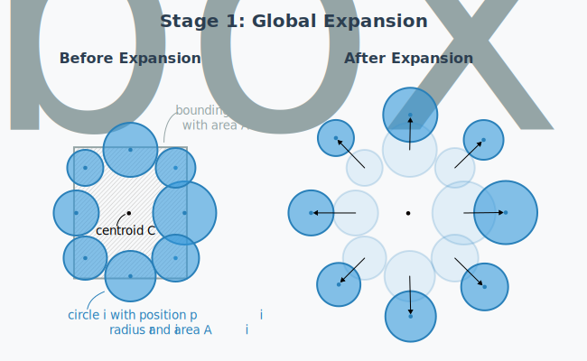
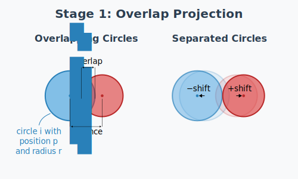
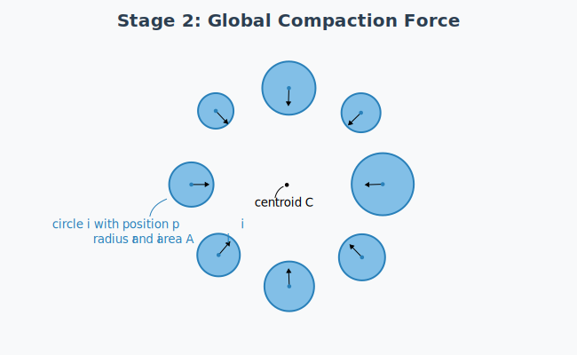
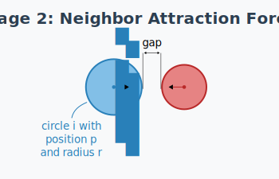
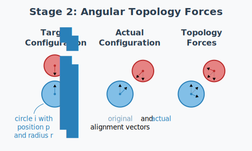
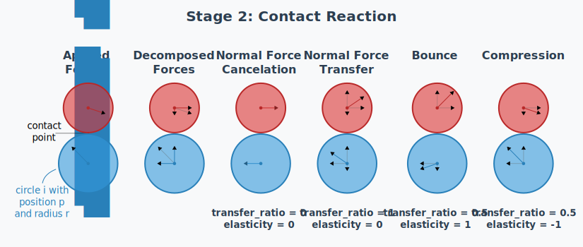

# Circle Packing Layout Algorithm

## Overview

The circle packing layout (`CirclePackingLayout`, string key `"topology"`) uses a two-stage force-based simulator — `TopologyPreservingSimulator` — to place proportionally-sized circles while preserving the topological relationships between neighboring regions. The simulator uses position-based dynamics with explicit contact reaction constraints, enabling circles to slide along each other at contact points.

Source: [placement.py](https://github.com/fkloosterman/carto-flow/blob/main/src/carto_flow/symbol_cartogram/placement.py)

## Algorithm Architecture

### Two-Stage Design

The algorithm operates in two sequential stages: **Stage 1 (Overlap Resolution)** achieves a valid non-overlapping configuration through iterative global expansion and local separation, while **Stage 2 (Circle Packing)** optimizes positions using local and global forces with contact reaction constraints and smoothed step integration, iterating until convergence.



## Stage 1: Overlap Resolution

Stage 1 uses an iterative combination of global expansion (keeping relative position of circles intact) and local separation (especially effective for circles with large overlaps) to reach a configuration of non-overlapping circles.

### Global Expansion

For any pair of circles, if the actual distance between their centers, $d_{ij}$, is smaller than their touching distance (i.e., the sum of the radii $r_i$ and $r_j$, and any desired spacing $\sigma$), then the circles overlap. The ratio between the touching distance and the actual distance defines an expansion factor that when applied (keeping the radii constant, and relative to any origin, but in our case the centroid of all circles $\mathbf{C}$), separates the two circles exactly at the touching distance.

From all circle pairs, the maximum expansion factor is computed and capped at $s_{\text{max}}$. In each iteration of the overlap resolution, expansion is performed at a customizable fraction $\rho^{\text{global}}$ of the maximum capped expansion factor. Note that capping the expansion factor is needed to avoid extremely large expansion factors due to circles that (almost) completely overlap. This type of large overlap is best resolved using the local separation described below. Note that expansion is only performed when the expansion factor $s>1$. The final equation for the expansion factor $s$ is:

$$
d_{ij}=\|\mathbf{p}_i - \mathbf{p}_j\|
$$

$$
d_{ij}^{\text{touch}}=r_i + r_j + \sigma
$$

$$
s = 1 + \rho^{\text{global}}\left( \min \left( \max_{ij} \left( \frac{d_{ij}^{\text{touch}}}{d_{ij}} \right), s_{\text{max}} \right) - 1 \right)
$$

Add the positions of the circles after expansion are given by:

$$
\mathbf{p}_i^{\text{expanded}} = \mathbf{C} + s \cdot (\mathbf{p}_i - \mathbf{C})
$$



### Local Separation

Local separation of overlapping circle pairs is performed by pushing the circles apart along the line that connects their centers. For coincident circles, a random direction for separation is chosen. For each circle pair, we determine the overlap $o_{ij} = d_{ij}^{\text{touch}}-d_{ij}$ and the unit vector $\hat{\mathbf{u}}_{ij} = \frac{\mathbf{p}_j - \mathbf{p}_i}{\| \mathbf{p}_j - \mathbf{p}_i \|}$. Each circle is then moved by $\delta_{ij}=\frac{1}{2} \rho^{\text{local}} o_{ij} \cdot \hat{\mathbf{u}}_{ij}$. The new circle positions then become:

$$
\mathbf{p}_i^{\text{new}} = \mathbf{p}_i^{\text{old}} - \frac{1}{2} \rho^{\text{local}} o_{ij} \cdot \hat{\mathbf{u}}_{ij}
$$

$$
\mathbf{p}_j^{\text{new}} = \mathbf{p}_j^{\text{old}} + \frac{1}{2} \rho^{\text{local}} o_{ij} \cdot \hat{\mathbf{u}}_{ij}
$$

### Convergence

The overlap resolution stage ends when either the maximum iterations has been reached or the maximum remaining circle overlap is smaller than a tolerance level $\tau$ (defined as a fraction of the mean circle radius): $\underset{ij}\max(o_{ij})<\tau \cdot \bar{r}$.



## Stage 2: Circle Packing

In the second stage, circle positions are optimized to preserve topology as much as possible (and desired). A force-based simulator uses position-based dynamics with four attraction forces, combined with explicit contact reaction constraints and local overlap resolution.

### Force Components

The total force acting on each circle $i$ is the sum of:
- a global compaction force $\mathbf{f}_i^{\text{global}}$ that pulls circles towards the (original) centroid of all circles
- a pull force $\mathbf{f}_i^{\text{origin}}$ towards the original circle positions
- a neighbor attraction force $\mathbf{f}_i^{\text{neigh}}$ that keeps circles representing adjacent geometries together
- a topological attraction force $\mathbf{f}_i^{\text{topo}}$ that tries to maintain the relative orientation between neighboring circles according to the topology of the original geometries

Let's define a single force vector acting on a circle as $\vec{f}=\left\langle f_{x}, f_{y} \right\rangle$ and the vector of forces acting on all $n$ circles as $\mathbf{f}=\left[\vec{f}_1,\cdots,\vec{f}_n \right]^{\top}$. We can now define a matrix that combines all three attractive forces as $\mathbf{F}=\left[ \mathbf{f}^{\text{global}}, \mathbf{f}^{\text{origin}}, \mathbf{f}^{\text{neigh}}, \mathbf{f}^{\text{topo}} \right]$. The four forces are combined through user-defined weights $\mathbf{w}=\left[ w^{\text{global}}, w^{\text{origin}}, w^{\text{neigh}}, w^{\text{topo}} \right]$ and passed through a contact reaction function $K$ that cancels or otherwise modifies compressing forces acting on touching (or overlapping) circles. For each iteration in the algorithm, the final forces acting on the circles is then: $\mathbf{f}_t = K \left( \mathbf{F_t}\mathbf{w}^{\top} \right)$.

#### 2.1 Global Compaction

Pulls circles toward the area-weighted centroid. The force direction always points toward the centroid $\mathbf{C}$:

$$
\hat{\mathbf{u}}_i = \frac{\mathbf{C} - \mathbf{p}_i}{\|\mathbf{C} - \mathbf{p}_i\|}
$$

The force magnitude depends on the `force_mode` parameter:

| Mode | Formula | Description |
|------|---------|-------------|
| `direction` | $\|\mathbf{f}\| = \min\left(1, \frac{d_i}{r_i}\right)$ | Constant magnitude with drop-off near centroid |
| `linear` | $\|\mathbf{f}\| = d_i$ | Spring-like: force proportional to distance |
| `normalized` | $\|\mathbf{f}\| = \frac{d_i}{r_i}$ | Distance normalized by circle radius |

where $d_i = \|\mathbf{C} - \mathbf{p}_i\|$ is the distance to centroid and $r_i$ is the circle radius..

The default `direction` mode provides uniform compaction without over-pulling large circles, while `linear` creates spring-like behavior and `normalized` scales force by circle size.



#### 2.2 Origin Attraction Force

Pulls each circle toward its original position. This force helps maintain the overall spatial distribution of circles while allowing packing optimization.

**Direction:**

$$
\hat{\mathbf{u}}_i = \frac{\mathbf{p}_i^0 - \mathbf{p}_i}{\|\mathbf{p}_i^0 - \mathbf{p}_i\|}
$$

where $\mathbf{p}_i^0$ is the original position of circle $i$.

**Force magnitude** (depends on `force_mode` parameter):

| Mode | Formula | Description |
|------|---------|-------------|
| `direction` | $\|\mathbf{f}\| = \min\left(1, \frac{d_i}{r_i}\right)$ | Constant magnitude with drop-off near origin |
| `linear` | $\|\mathbf{f}\| = d_i$ | Spring-like: force proportional to distance |
| `normalized` | $\|\mathbf{f}\| = \frac{d_i}{r_i}$ | Distance normalized by circle radius |

where $d_i = \|\mathbf{p}_i^0 - \mathbf{p}_i\|$ is the distance to original position.

**Usage notes:**
- Default `origin_weight = 0` disables this force
- Values 0.1-0.5 provide gentle pull toward original positions
- Values > 1.0 create strong pull that may interfere with topology preservation

#### 2.3 Neighbor Force

Pulls separated adjacent circles together. The force only acts on pairs $(i, j)$ that are marked as neighbors in the adjacency matrix and are currently separated by a positive gap.

**Definitions:**

$$
d_{\text{target}} = r_i + r_j + \sigma
$$

$$
g = d_{ij} - d_{\text{target}} = \|\mathbf{p}_j - \mathbf{p}_i\| - (r_i + r_j + \sigma)
$$

**Force formula** (active only when $g > 0$):

$$
\mathbf{F}_{ij}^{\text{neigh}} = w_{ij} \cdot \min\left(\frac{g}{d_{\text{target}}}, 1\right) \cdot \hat{\mathbf{u}}_{ij}
$$

where:
- $\hat{\mathbf{u}}_{ij} = \frac{\mathbf{p}_j - \mathbf{p}_i}{\|\mathbf{p}_j - \mathbf{p}_i\|}$ is the unit direction from $i$ to $j$
- $w_{ij}$ is the adjacency weight for the pair (allows weighted adjacency relationships)
- The strength is capped at 1.0 to prevent excessive forces for large gaps

**Behavior:**
- When circles are touching or overlapping ($g \leq 0$): no neighbor force applied
- When circles are slightly separated: gentle pull proportional to gap
- When circles are far apart: maximum strength pull (capped)



#### 2.4 Distance-Gated Angular Topology Force

Preserves the angular relationship between adjacent circles by trying to align their current direction vector with the original direction vector.

**Definitions:**

$$
\hat{\mathbf{u}}_0 = \frac{\mathbf{p}_j^0 - \mathbf{p}_i^0}{\|\mathbf{p}_j^0 - \mathbf{p}_i^0\|} \quad \text{(original unit direction)}
$$

$$
\hat{\mathbf{u}} = \frac{\mathbf{p}_j - \mathbf{p}_i}{\|\mathbf{p}_j - \mathbf{p}_i\|} \quad \text{(current unit direction)}
$$

$$
g = d_{ij} - (r_i + r_j + \sigma) \quad \text{(gap, same as neighbor force)}
$$

**Distance gate function:**

$$
w(g) = \begin{cases}
1 & \text{if } g \leq 0 \text{ (touching/overlapping)} \\
\left(1 - \frac{g}{g_{\max}}\right)^2 & \text{if } 0 < g < g_{\max} \\
0 & \text{if } g \geq g_{\max}
\end{cases}
$$

**Force formula:**

$$
\mathbf{F}_{ij}^{\text{topo}} = w_{\text{topo}} \cdot w_{ij} \cdot w(g) \cdot (\hat{\mathbf{u}}_0 - \hat{\mathbf{u}})
$$

where $w_{ij}$ is the adjacency weight for the pair.

**Behavior:**
- When circles are touching ($g \leq 0$): full force strength to restore original orientation
- When circles are separated by up to $g_{\max}$: smoothly decaying force
- When circles are far apart ($g \geq g_{\max}$): no topology force (prevents distant circles from affecting each other)

**Key insight**: The force direction $(\hat{\mathbf{u}}_0 - \hat{\mathbf{u}})$ rotates the current direction toward the original direction, preserving the angular relationship without changing the distance.




## Contact Reaction

The contact reaction constraint allows circles to slide along each other without penetrating. This is critical for achieving tight packing. The behavior is controlled by two parameters:

- **`contact_transfer_ratio`** (0-1): Balance between canceling and transferring compressive forces
- **`contact_elasticity`** (-1 to 1): Controls net compression vs bounce behavior

### Mathematical Formulation

For circles in contact, decompose the force into normal and tangential components:

$$
\mathbf{F} = F_n \cdot \hat{\mathbf{n}} + F_t \cdot \hat{\mathbf{t}}
$$

The contact reaction applies two operations:

**1. Cancel compressive component:**

$$
\mathbf{F}_i^{\text{after}} = \mathbf{F}_i^{\text{before}} - a \cdot \max(0, F_n^i) \cdot \hat{\mathbf{n}}_{ij}
$$

**2. Transfer compressive component:**

$$
\mathbf{F}_j^{\text{after}} = \mathbf{F}_j^{\text{before}} + b \cdot \max(0, F_n^i) \cdot \hat{\mathbf{n}}_{ij}
$$

where the coefficients are computed as:

$$
s = \frac{1 - \text{elasticity}}{1 + \text{elasticity}}
$$

$$
a = (1 - \text{transfer\_ratio})^s
$$

$$
b = \text{transfer\_ratio}^s
$$

### Parameter Effects

| `transfer_ratio` | `elasticity` | Behavior |
|------------------|--------------|----------|
| 0.0 | any | Pure cancel - compressive forces dissipate |
| 1.0 | any | Pure transfer - forces pass through contacts |
| 0.5 | 0.0 | Balanced cancel/transfer |
| 0.5 | -1.0 | Compression favored (forces tend to pass through) |
| 0.5 | 1.0 | Bounce favored (forces tend to reflect) |

This allows tangential sliding while controlling how compressive forces are handled at contact points:



## Step Integration with Clamping

Each packing iteration computes forces, resolves contacts, and integrates positions with step clamping:

**Step size formula:**

$$
\Delta \mathbf{p}_i = \min\left(1, \frac{\Delta_{\max}}{\|\mathbf{F}_i\|}\right) \cdot \mathbf{F}_i \cdot r_i^{\text{eff}}
$$

where $r_i^{\text{eff}} = \bar{r} \left(\frac{r_i}{\bar{r}}\right)^{\sigma_{\text{size}}}$ is the effective radius controlled by `size_sensitivity` ($\sigma_{\text{size}}$).

**Step smoothing via EMA:**

$$
\mathbf{s}_t = \alpha \cdot \mathbf{s}_t^{\text{raw}} + (1 - \alpha) \cdot \mathbf{s}_{t-1}
$$

where $\alpha = \frac{2}{n_{\text{eff}} + 1}$ and $n_{\text{eff}}$ is the `step_smoothing_window` parameter (default: 20).

## Convergence Criteria

The simulator converges when the system reaches a steady state, detected by tracking the drift rate:

**Drift and jitter metrics:**

$$
\text{drift} = \frac{1}{n} \sum_{i=1}^{n} \frac{\|\boldsymbol{\mu}_i\|}{r_i}
$$

$$
\text{jitter} = \frac{1}{n} \sum_{i=1}^{n} \frac{\sigma_i}{r_i}
$$

where $\boldsymbol{\mu}_i$ and $\sigma_i$ are the EMA mean and standard deviation of the displacement vector for circle $i$.

**Convergence condition:**

$$
\text{EMA}(\text{drift_rate} < 0) < 0.5
$$


The system converges when the smoothed fraction of negative drift rates falls below 0.5, indicating that the system is no longer systematically moving toward equilibrium.

## Parameter Reference

| Parameter | Symbol | Type | Default | Description |
|-----------|--------|------|---------|-------------|
| `spacing` | $\sigma$ | float | 0.05 | Minimum gap as fraction of avg radius |
| `compactness` | $w^{\text{global}}$ | float | 0.5 | Global compaction strength (0-1) |
| `origin_weight` | $w^{\text{origin}}$ | float | 0.0 | Origin attraction strength. 0=disabled; 0.1-0.5=gentle pull; >1.0=strong pull |
| `topology_weight` | $w^{\text{topo}}$ | float | 0.3 | Topology preservation strength (0-1) |
| `neighbor_weight` | $w^{\text{neigh}}$ | float | 0.5 | Neighbor tangency force coefficient |
| `force_mode` | - | str | "direction" | Force magnitude mode: "direction", "linear", or "normalized" |
| `max_step` | $\Delta_{\max}$ | float | 0.3 | Maximum step size (fraction of avg radius) |
| `overlap_tolerance` | $\tau$ | float | 1e-4 | Overlap tolerance for overlap resolution (fraction of avg radius) |
| `expansion_max_iterations` | - | int | 20 | Maximum iterations for overlap resolution |
| `max_expansion_factor` | $s_{\text{max}}$ | float | 2.0 | Maximum expansion factor clamp per iteration |
| `global_step_fraction` | $\rho^{\text{global}}$ | float | 0.5 | Fraction of global expansion to apply per iteration |
| `local_step_fraction` | $\rho^{\text{local}}$ | float | 0.5 | Fraction of local separation to apply per iteration |
| `topology_gate_distance` | $g_{\max}$ | float | 2.5 | Topology force gate distance (in sum of radii) |
| `contact_tolerance` | - | float | 0.02 | Contact detection tolerance (fraction of sum of radii) |
| `contact_iterations` | - | int | 3 | Number of contact reaction passes per packing step |
| `contact_transfer_ratio` | - | float | 0.5 | Balance between cancel (0) and transfer (1) of compressive forces |
| `contact_elasticity` | - | float | 0.0 | Controls compression vs bounce (-1 to 1). Negative=pass through; positive=bounce |
| `size_sensitivity` | $\sigma_{\text{size}}$ | float | 0.0 | Step size scaling with radius. 0=uniform; 1=larger faster; -1=larger slower |
| `overlap_projection_iters` | - | int | 5 | Overlap projection iterations per packing step |
| `step_smoothing_window` | $n_{\text{eff}}$ | int | 20 | EMA window for step smoothing |
| `convergence_window` | - | int | 50 | EMA window for convergence tracking |
| `adaptive_ema` | - | bool | True | Whether EMA uses adaptive warmup (alpha starts at 1/k) |

## Usage Example

```python
import numpy as np
from carto_flow.symbol_cartogram.placement import TopologyPreservingSimulator

# Initialize with circle data
simulator = TopologyPreservingSimulator(
    positions=initial_positions,      # Shape: (n, 2)
    radii=radii,                       # Shape: (n,)
    original_positions=centroids,     # Shape: (n, 2)
    adjacency=adjacency_matrix,       # Shape: (n, n), required for topology
    spacing=0.05,
    compactness=0.5,
    topology_weight=0.3,
    overlap_tolerance=1e-4,
    max_expansion_factor=2.0,
    topology_gate_distance=2.5,
    neighbor_weight=0.5,
    contact_tolerance=0.02,
    max_step=0.3,
    contact_transfer_ratio=0.5,      # Balance cancel vs transfer
    contact_elasticity=0.0,          # Neutral compression behavior
    size_sensitivity=0.0             # Uniform step size for all circles
)

# Run simulation
final_positions, info, history = simulator.run(
    max_iterations=500,
    tolerance=1e-4,
    show_progress=True,
    save_history=False
)

print(f"Converged: {info['converged']}")
print(f"Overlap resolution iterations: {info['stage1_iterations']}")
print(f"Packing iterations: {info['stage2_iterations']}")
print(f"Final overlaps: {info['final_overlaps']}")
```

## Return Value

The `run()` method returns:

```python
(
    final_positions: np.ndarray,    # Shape: (n, 2) in original coordinates
    info: dict,                      # Simulation statistics
    history: list[np.ndarray] | None # Position history if save_history=True
)
```

**Info dictionary:**

```python
{
    "iterations": int,            # Total iterations (stage1 + stage2)
    "converged": bool,            # Whether convergence criteria met
    "final_overlaps": int,        # Remaining overlap count
    "stage1_iterations": int,     # Iterations in Stage 1
    "stage2_iterations": int,     # Iterations in Stage 2
    "final_mean_step": float,     # Final mean step magnitude
    "final_rel_change": float,    # Final relative change in step magnitude
}
```
