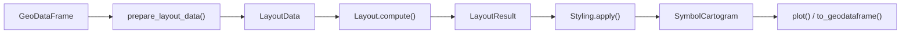

# Symbol Cartogram Pipeline

## Overview

A symbol cartogram replaces each polygon region with a proportionally-sized symbol — a circle, square, hexagon, or custom tile — whose area encodes a data value. Symbols are repositioned to avoid overlap while preserving the spatial arrangement and adjacency relationships of the original regions.

The pipeline has four stages: data preprocessing produces a `LayoutData` object from a GeoDataFrame; a layout algorithm computes symbol positions and stores them in an immutable `LayoutResult`; a `Styling` object maps symbol shape and transform decisions onto the layout; and the final `SymbolCartogram` contains the symbol geometries and quality metrics.

Source: [api.py](https://github.com/fkloosterman/carto-flow/blob/main/src/carto_flow/symbol_cartogram/api.py)



**Two API levels** are available. The all-in-one function `create_symbol_cartogram(gdf, value_column, ...)` runs the full pipeline in one call. The two-step API `create_layout(gdf, value_column, ...)` followed by `layout_result.style(...)` separates layout computation (expensive) from styling (fast), enabling multiple styling variations from a single computed layout.

---

## Data Preprocessing

Source: [data_prep.py](https://github.com/fkloosterman/carto-flow/blob/main/src/carto_flow/symbol_cartogram/data_prep.py)

`prepare_layout_data(gdf, value_column, ...)` takes a GeoDataFrame of polygon regions and returns a `LayoutData` dataclass with four fields:

```python
@dataclass
class LayoutData:
    positions: NDArray   # centroids, shape (n, 2)
    sizes:     NDArray   # area-equivalent radii, shape (n,)
    adjacency: NDArray   # adjacency matrix, shape (n, n)
    bounds:    tuple     # geographic bounding box
    mean_area: float     # mean input geometry area
    source_gdf: gpd.GeoDataFrame
```

### Symbol Sizes

`compute_symbol_sizes(values, scale, ...)` converts data values to area-equivalent radii (the radius such that circle area = π × radius² is proportional to the value). Three scaling modes:

| Mode | Relationship | Use case |
|------|-------------|----------|
| `"sqrt"` (default) | area ∝ value | Perceptually accurate for cartograms |
| `"linear"` | radius ∝ value | Visual size grows linearly |
| `"log"` | log(1 + value) | Compresses highly skewed distributions |

The `size_max_value` parameter fixes the reference maximum, enabling consistent size scaling across multiple cartograms of different datasets.

### Adjacency Matrix

`compute_adjacency(gdf, mode, distance_tolerance)` builds a symmetric or asymmetric matrix from polygon boundary relationships. A distance tolerance (default: 0.1% of the mean region diameter) handles small gaps common in real-world boundary data.

| Mode | Formula | Property |
|------|---------|---------|
| `"binary"` | 1 if shared boundary, else 0 | Symmetric |
| `"weighted"` | w[i,j] = shared\_length / perimeter[i] | Asymmetric |
| `"area_weighted"` | w[i,j] = area[j] / Σ neighbor\_areas[i] | Rows sum to 1 |

The adjacency matrix is used by layout algorithms to keep geographically adjacent symbols close together.

---

## Layout System

Source: [layout.py](https://github.com/fkloosterman/carto-flow/blob/main/src/carto_flow/symbol_cartogram/layout.py), [layout_result.py](https://github.com/fkloosterman/carto-flow/blob/main/src/carto_flow/symbol_cartogram/layout_result.py)

### Layout ABC

`Layout` is an abstract base class with one method:

```python
class Layout(ABC):
    @abstractmethod
    def compute(self, data: LayoutData, ...) -> LayoutResult: ...
```

Four concrete implementations are registered under string keys and can be selected by name:

| String key | Class | Description |
|-----------|-------|-------------|
| `"topology"` | `CirclePackingLayout` | Two-stage physics with contact constraints; good topology preservation |
| `"physics"` | `CirclePhysicsLayout` | Velocity-based two-phase simulation; general purpose |
| `"grid"` | `GridBasedLayout` | Hungarian assignment to a regular tile grid |
| `"centroid"` | `CentroidLayout` | Symbol at centroid; optional local overlap removal |

Algorithm details are in the [Grid Layout Algorithm](symbol-cartogram-grid-layout.md) and [Circle Packing Layout Algorithm](symbol-cartogram-circle-packing.md) explanations.

### LayoutResult

`LayoutResult` is an immutable dataclass produced by every layout algorithm:

```python
@dataclass
class LayoutResult:
    canonical_symbol: Symbol
    transforms:       list[Transform]   # one per region
    base_size:        float
    positions:        NDArray
    sizes:            NDArray
    adjacency:        NDArray
    bounds:           tuple
    crs:              str | None
    algorithm_info:   dict
    simulation_history: Any
```

Immutability ensures the computed positions are never modified after the layout runs, making it safe to apply multiple styling configurations to the same result.

`LayoutResult.serialize()` / `LayoutResult.from_serialized()` round-trip to JSON, allowing the expensive computation to be saved and reloaded.

### Transform

Each region's placement is captured in a frozen `Transform` dataclass:

```python
@dataclass(frozen=True)
class Transform:
    position:   tuple[float, float]   # symbol center (x, y)
    rotation:   float                  # radians
    scale:      float                  # multiplier relative to base_size
    reflection: bool                   # vertical axis flip
```

`transform.compose(other)` chains two transforms — used internally when the tiling geometry has its own rotation or reflection.

---

## Styling System

Source: [styling.py](https://github.com/fkloosterman/carto-flow/blob/main/src/carto_flow/symbol_cartogram/styling.py), [symbols.py](https://github.com/fkloosterman/carto-flow/blob/main/src/carto_flow/symbol_cartogram/symbols.py)

`Styling` collects symbol shape, transform overrides, and fit-mode decisions. `styling.apply(layout_result)` maps these decisions onto the transforms in a `LayoutResult` to produce a `SymbolCartogram`. The layout itself is not re-run.

### Symbols

`Symbol` is an abstract base class that defines a shape in the unit square [−0.5, 0.5]² via `unit_polygon()`. Concrete symbols:

| String alias | Class | Notes |
|-------------|-------|-------|
| `"circle"` | `CircleSymbol` | Inscribed radius = 0.5 |
| `"square"` | `SquareSymbol` | Axis-aligned |
| `"hexagon"` | `HexagonSymbol` | `pointy_top` parameter |
| — | `IsohedralTileSymbol` | For tiling-based shapes |

Custom symbols subclass `Symbol` and implement `unit_polygon()`.

### Per-Geometry Overrides

`set_symbol()`, `transform()`, and `set_params()` each accept three targeting forms:

```python
# All regions
styling.set_symbol("hexagon")

# By index list
styling.set_symbol("square", indices=[0, 1, 2])

# By boolean mask
styling.set_symbol("circle", mask=(gdf["region"] == "West").values)

# Per-region positional array
styling.set_symbol(["circle", "hexagon", "square", ...])
```

The fluent API supports method chaining: `Styling().set_symbol("hexagon").transform(scale=0.9)`.

### FitMode

`FitMode` controls how the styled symbol is scaled into its canonical slot:

| Mode | Behavior |
|------|---------|
| `INSIDE` (default) | Symbol is guaranteed inside the tile boundary; centered |
| `AREA` | Symbol area equals tile area; may extend outside boundary |
| `FILL` | Maximizes symbol size while staying inside; center may shift (requires SciPy) |

---

## SymbolCartogram Result

Source: [result.py](https://github.com/fkloosterman/carto-flow/blob/main/src/carto_flow/symbol_cartogram/result.py)

`SymbolCartogram` is the final result object returned by the pipeline.

### Fields

- **`symbols`**: GeoDataFrame with one row per region. Internal columns: `_symbol_x`, `_symbol_y`, `_symbol_size`, `_displacement`, `original_index`.
- **`status`**: `CONVERGED` (convergence criterion met), `COMPLETED` (max iterations reached), or `ORIGINAL` (no layout run).
- **`metrics`**: dict with `displacement_mean`, `displacement_max`, `displacement_std`, `topology_preservation` (fraction of adjacencies preserved), `iterations`, `n_skipped`.
- **`simulation_history`**: optional `SimulationHistory` with per-iteration diagnostics (positions, overlaps, convergence metrics).
- **`layout_result`**: the `LayoutResult` from which this cartogram was produced.
- **`styling`**: the `Styling` configuration applied.

### Methods

**`restyle(styling=None, **kwargs)`** creates a new `SymbolCartogram` with different styling without re-running the layout. Requires `layout_result` to be present.

**`to_geodataframe(source_gdf=None)`** exports the symbols as a GeoDataFrame, optionally joining original attributes from `source_gdf`.

**`get_displacement_vectors()`** returns an (n, 2) array of displacement vectors from original centroids to final symbol centers.

**`plot(...)`** plots the symbol cartogram with data-driven styling options. Covered in the [Style Symbol Cartograms](../how-to/style-symbols-by-category.ipynb) how-to.
