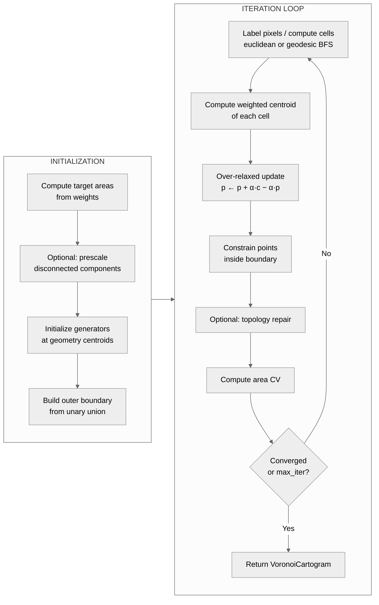

# Voronoi Cartogram Algorithm

## Overview

A Voronoi cartogram represents each region as a Voronoi cell whose area is
proportional to a data variable. Rather than deforming polygon boundaries
(as in flow cartograms), the algorithm moves a set of generator points —
initially placed at geometry centroids — until each point's Voronoi cell
has the correct target area. The result is a **Centroidal Voronoi
Tessellation** (CVT): a tessellation where every generator is the
weighted centroid of its own cell.

The implementation lives in
[`backends.py`](https://github.com/bright-fakl/carto-flow/blob/main/src/carto_flow/voronoi_cartogram/backends.py)
and the `fields/` package.
The entry point is `create_voronoi_cartogram()`
([`api.py`](https://github.com/bright-fakl/carto-flow/blob/main/src/carto_flow/voronoi_cartogram/api.py)).

## Mathematical Foundation

### CVT Condition

Given $G$ regions with weights $w_1, \ldots, w_G$ and a convex outer
boundary $\Omega$, a CVT satisfies:

$$
\mathbf{p}_i = \frac{\int_{V_i} \mathbf{x} \, \rho(\mathbf{x}) \, d\mathbf{x}}{\int_{V_i} \rho(\mathbf{x}) \, d\mathbf{x}}
$$

where $V_i$ is the Voronoi cell of generator $\mathbf{p}_i$ and $\rho$ is a
density field proportional to the target weights. For uniform density within
each cell this reduces to: each generator equals the area-weighted centroid
of its cell.

### Error Metric

Convergence is tracked by the **area coefficient of variation** (area CV):

$$
\text{area\_cv} = \frac{\sigma(a_i / a_i^{\text{target}})}{\bar{a} / \bar{a}^{\text{target}}}
$$

where $a_i$ is the current cell area and $a_i^{\text{target}} \propto w_i$.
Lower is better; zero means perfect proportionality.

### Lloyd Relaxation Update

Each iteration applies one step of **Lloyd relaxation** with
successive over-relaxation (SOR):

$$
\mathbf{p}_i^{\text{new}} = \mathbf{p}_i + \alpha \left(\mathbf{c}_i - \mathbf{p}_i\right)
$$

where $\mathbf{c}_i$ is the weighted centroid of cell $V_i$ and $\alpha > 1$
is the over-relaxation factor (SOR accelerates convergence compared to
$\alpha = 1$).

---

## Computational Pipeline

### Initialization

1. Compute target areas: $a_i^{\text{target}} = w_i \cdot A_{\text{total}} / \sum w_j$, where $A_{\text{total}}$ is the area of the outer union boundary.
2. Optionally prescale disconnected components (see [Prescaling](#prescaling)).
3. Place one generator at each geometry's centroid (or representative point if the centroid falls outside the geometry).
4. Build the outer boundary polygon as `unary_union(geometries)`, optionally simplified by `options.simplify_tol`.

### Per-Iteration Steps

**Pixel labeling / cell computation** differs by backend (see [Backends](#the-two-backends)).

**Weighted centroid**: For the raster backend, the centroid of cell $i$ is:

$$
\mathbf{c}_i = \frac{\sum_{k \in V_i} \mathbf{x}_k \cdot w_i}{\sum_{k \in V_i} w_i}
$$

where the sum is over pixels $k$ inside the cell, and weight $w_i$ is the
target area normalised weight of generator $i$.

**Over-relaxed update**: $\mathbf{p}_i \leftarrow \mathbf{p}_i + \alpha(\mathbf{c}_i - \mathbf{p}_i)$

**Boundary constraint**: any generator that drifts outside the outer boundary is hard-snapped back to the nearest boundary edge point.

---

## The Two Backends

### RasterBackend (default)

Labels a raster grid of `resolution × resolution` pixels by the nearest
generator. The weighted centroid of each label region is then computed as
a pixel average.

**Speed**: 10–50× faster than the exact backend because centroid computation reduces to array indexing (no geometric intersection).

Key parameters:

| Parameter | Default | Description |
|---|---|---|
| `resolution` | 300 | Pixel grid size (longer axis) |
| `relaxation` | `"overrelax"` | SOR factor schedule |
| `distance_mode` | `"euclidean"` | `"euclidean"` or `"geodesic"` (see [Geodesic Labeling](voronoi-cartogram-geodesic-labeling.md)) |
| `area_equalizer_rate` | 0.1 | Power-diagram bias learning rate |
| `boundary` | `None` | `AdhesiveBoundary` or `ElasticBoundary` |
| `adjacency_spring` | 0.0 | Spring strength preserving adjacency |

**Pure FFT-flow mode**: pass `relaxation=0.0` together with `ElasticBoundary` to skip Lloyd relaxation entirely and drive movement solely from area-pressure via the FFT velocity field.

### ExactBackend

Computes `scipy.spatial.Voronoi` on the generator points augmented with
mirror points at the boundary, then clips each infinite/bounded cell to the
outer boundary using shapely intersection.

**Accuracy**: geometrically exact cells. Useful for small datasets or when
precise cell shapes matter for downstream analysis.

**Limitation**: does not support `ElasticBoundary` (only `AdhesiveBoundary`).

---

## Relaxation Schedule

The over-relaxation factor $\alpha$ controls step size. A value $\alpha > 1$
(SOR) converges faster than plain Lloyd ($\alpha = 1$) but can overshoot if
too large.

`RelaxationSchedule(start, decay, minimum)` decays the factor geometrically:

$$
\alpha_i = \max(\text{minimum},\ \text{start} \times \text{decay}^i)
$$

The shorthand `"overrelax"` resolves to `RelaxationSchedule(start=1.9, decay=0.98, minimum=1.0)`. Passing a plain float (e.g. `relaxation=1.5`) uses a constant factor. A callable `f(iteration) -> float` allows arbitrary schedules.

---

## Convergence Criteria

The algorithm stops at the first satisfied condition:

| Criterion | Parameter | Description |
|---|---|---|
| Area CV tolerance | `area_cv_tol` | Stop when `area_cv < area_cv_tol` |
| Displacement tolerance | `tol` | Stop when max centroid displacement per iter < `tol` (in CRS units) |
| Iteration limit | `n_iter` | Hard stop after `n_iter` iterations (default 30) |

---

## Prescaling

When `VoronoiOptions(prescale_components=True)`, each group of geometrically
connected polygons is uniformly scaled to its collective target area **before**
the Lloyd iteration starts. This is the same routine used by the flow cartogram
(`prescale_connected_components()` from
[`flow_cartogram/prescale.py`](https://github.com/bright-fakl/carto-flow/blob/main/src/carto_flow/flow_cartogram/prescale.py)).

Prescaling reduces initial area CV, allowing faster convergence with fewer
iterations. It is particularly effective when some regions are far from their
target areas at the start.

---

## Boundary Behaviour

By default the outer boundary is **fixed**: generators are constrained inside
it and the boundary polygon does not change.

**`AdhesiveBoundary(strength)`**: generators whose geometry touches the outer
boundary are attracted toward the boundary edge (snapped by `strength ∈ [0,1]`
toward the nearest boundary point). Available on both backends.

**`ElasticBoundary(strength, step_scale, density_smooth, min_boundary_points, adhesion_strength)`**: the boundary
vertices themselves are advected by an FFT-derived velocity field proportional
to the area pressure at each cell. The outer hull flexes to accommodate large
area changes at the periphery. Available on `RasterBackend` only.
`min_boundary_points` densifies simple shapes (e.g. `"bbox"`) for smoother
deformation; `adhesion_strength` combines elastic deformation with centroid
adhesion in a single pass (equivalent to `AdhesiveBoundary` but with the snap
target tracking the evolving boundary shape).

---

## Limitations

**Fixed topology order.** Voronoi cells are assigned to generators by position;
if two generators cross, their cell assignments may swap unexpectedly. Use
`TopologyRepair` or `repair_topology()` to detect and fix this (see
[Contiguity Repair](voronoi-cartogram-contiguity.md)).

**Boundary artefacts.** The outer boundary is treated as hard walls. Peripheral
generators may cluster near the boundary if their target area is large compared
to available boundary-adjacent space. `ElasticBoundary` mitigates this.

**Resolution trade-off (RasterBackend).** Higher `resolution` gives smoother
cell boundaries and more accurate centroids but increases memory and compute
time quadratically. Values of 300–512 are typical.
