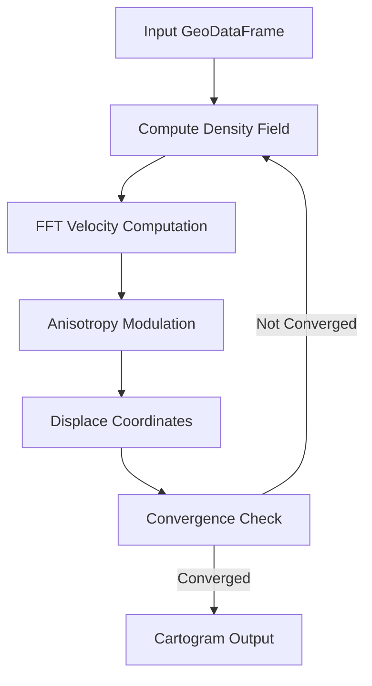

# Flow Cartogram

Cartogram generation with flow-based morphing.

## Overview

The flow_cartogram module generates flow-based contiguous cartograms where polygon areas are deformed to be proportional to a data variable (e.g., population, GDP). It uses a diffusion-based algorithm that preserves topology while smoothly transforming geometries.

**Core Algorithm**: Iteratively computes density → velocity → displacement fields until regions reach target areas.



## Main Interface

| Sub-module | Description |
|------------|-------------|
| **[API](api.md)** | High-level functions (`morph_gdf`, `multiresolution_morph`) |
| **[Options](options.md)** | Configuration options and status enums |
| **[Cartogram](cartogram.md)** | Cartogram result class with visualization and export |
| **[Workflow](workflow.md)** | Workflow class for iterative refinement |
| **[Errors](errors.md)** | Error metrics computation |

## Computation

| Sub-module | Description |
|------------|-------------|
| **[Algorithm](algorithm.md)** | Core morphing algorithm |
| **[Grid](grid.md)** | Grid utilities for spatial discretization |
| **[Density](density.md)** | Density field computation and density modulators |
| **[Velocity](velocity.md)** | Velocity field computation using FFTW |
| **[Displacement](displacement.md)** | Coordinate displacement with numba |
| **[Anisotropy](anisotropy.md)** | Velocity modulator system (`BoundaryDecay`, `BoundaryNormalDecay`, `DirectionalTensor`, …) |

## Analysis

| Sub-module | Description |
|------------|-------------|
| **[History](history.md)** | Iteration history and snapshots |
| **[Metrics](metrics.md)** | Quality metrics and validation |
| **[Comparison](comparison.md)** | Comparison utilities for results |

## Output

| Sub-module | Description |
|------------|-------------|
| **[Visualization](visualization.md)** | Plotting utilities for results |
| **[Animation](animation.md)** | Animation generation utilities |
| **[Serialization](serialization.md)** | Export and save/load utilities |

## Workflow Patterns

### Basic Cartogram Generation

```python
from carto_flow.flow_cartogram import morph_gdf, MorphOptions

cartogram = morph_gdf(gdf, "population",
                      options=MorphOptions.preset_balanced())
cartogram.plot()
print(f"Status: {cartogram.status}")
print(f"Error: {cartogram.get_errors().mean_error_pct:.1f}%")
```

### Iterative Refinement

```python
from carto_flow.flow_cartogram import CartogramWorkflow

workflow = CartogramWorkflow(gdf, "population")
cartogram = workflow.morph()               # Initial pass
cartogram = workflow.morph(mean_tol=0.02)  # Refine with stricter tolerance
workflow.pop()                             # Undo if needed
```

### Multi-Resolution Cartogram

```python
from carto_flow.flow_cartogram import multiresolution_morph

cartogram = multiresolution_morph(gdf, "population",
                                  resolution=512, levels=3)
```

### With Displacement Field Output

```python
import numpy as np

x = np.linspace(0, 100, 50)
y = np.linspace(0, 80, 40)
X, Y = np.meshgrid(x, y)
displacement_coords = np.column_stack([X.ravel(), Y.ravel()])

cartogram = morph_gdf(gdf, "population",
                      displacement_coords=displacement_coords)
displaced = cartogram.get_coords()
```

### Visualization and Export

```python
from carto_flow.flow_cartogram import morph_gdf, MorphOptions
from carto_flow.flow_cartogram.visualization import plot_comparison, plot_convergence
from carto_flow.flow_cartogram.animation import animate_morph_history, save_animation

cartogram = morph_gdf(gdf, "population",
                      options=MorphOptions(save_internals=True))

plot_comparison(gdf, cartogram)
plot_convergence(cartogram.convergence)

anim = animate_morph_history(cartogram, duration=5.0)
save_animation(anim, "morph.gif", fps=15)

cartogram.save("output/cartogram.gpkg")
```

### Velocity Modulators

Velocity modulators control how the velocity field is transformed each iteration.
Modulators are chained with `+` and passed as `MorphOptions(anisotropy=...)`.

```python
from carto_flow.flow_cartogram import (
    morph_gdf, MorphOptions,
    BoundaryDecay, BoundaryNormalDecay, DirectionalTensor, VelocitySmooth,
)

# Suppress outward boundary drift while preserving tangential flow
mod = BoundaryNormalDecay(decay_length=50_000) + VelocitySmooth(sigma=20_000)
cartogram = morph_gdf(gdf, "population",
                      options=MorphOptions(anisotropy=mod))

# Simple multiplicative falloff combined with a radial directional bias
mod = BoundaryDecay(decay_length=80_000) + DirectionalTensor.radial(Dpar=2.0)
cartogram = morph_gdf(gdf, "population",
                      options=MorphOptions(anisotropy=mod))
```

### Density Modulators

Density modulators adjust the density field before velocity computation each iteration.
They are passed as `MorphOptions(density_mod=...)`.

```python
from carto_flow.flow_cartogram import morph_gdf, MorphOptions, DensityBorderExtension, DensitySmooth

mod = DensityBorderExtension(extension_width=50_000, transition_width=200_000) + DensitySmooth(sigma=20_000)
cartogram = morph_gdf(gdf, "population",
                      options=MorphOptions(density_mod=mod))
```

## Error Handling

| Exception | Description |
|-----------|-------------|
| `MorphOptionsError` | Base exception for option validation errors |
| `MorphOptionsValidationError` | Invalid option values (type, range, format) |
| `MorphOptionsConsistencyError` | Contradictory options (e.g., mean_tol > max_tol) |
| `ValueError` | Input validation failures |
