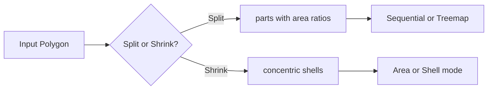

# Proportional Cartogram

Shape splitting, shrinking, and dot density algorithms for proportional visualizations.

## Overview

The proportional_cartogram module provides polygon division, shrinking, and dot density utilities for creating proportional visualizations within regions. It enables treemap-style layouts, concentric shell visualizations, multi-category area partitioning, and random dot density maps.

**Core Operations**:
- **Split**: Divide a geometry into parts with specified area ratios
- **Shrink**: Create concentric shells from outside to inside
- **Partition**: Batch process entire GeoDataFrames
- **Dot Density**: Generate random point distributions inside geometries



## Main Interface

| Sub-module | Description |
|------------|-------------|
| **[Splitting](splitting.md)** | `split()` — divide geometry into area-proportional parts |
| **[Shrinking](shrinking.md)** | `shrink()` — create concentric shells |
| **[Partition](partition.md)** | `partition_geometries()` — batch GeoDataFrame processing |
| **[Visualization](visualization.md)** | `plot_partitions()` — choropleth visualization |
| **[Dot Density](dot_density.md)** | `generate_dot_density()`, `plot_dot_density()` |

## Workflow Patterns

### Cartogram with Multi-Category Partitioning

```python
from carto_flow.flow_cartogram import morph_gdf, MorphOptions
from carto_flow.proportional_cartogram import partition_geometries
from carto_flow.proportional_cartogram.visualization import plot_partitions

# Generate cartogram
cartogram = morph_gdf(gdf, "total_gdp", options=MorphOptions.preset_balanced())

# Partition morphed geometries by sector
partitioned = partition_geometries(
    cartogram.to_geodataframe(),
    ["agriculture", "industry", "services"],
    method="split",
    strategy="treemap",
    normalization="row"
)

plot_partitions(partitioned, color_by="category", legend=True)
```

### Shrink with Remainder

```python
from carto_flow.proportional_cartogram import partition_geometries

result = partition_geometries(
    gdf,
    ["category_a", "category_b"],
    method="shrink",
    normalization="maximum"
)
# → geometry_category_a (outer), geometry_category_b (core),
#   geometry_complement (remainder)
```

### Dot Density Map

```python
from carto_flow.proportional_cartogram import plot_dot_density

result = plot_dot_density(
    gdf,
    columns=["agriculture", "industry", "services"],
    normalization="row",
    n_dots=150,
    seed=42,
)
```

## Error Handling

| Exception | Description |
|-----------|-------------|
| `ValueError` | Invalid fractions, columns not found, negative values |
| `TypeError` | Input not DataFrame/GeoDataFrame |
