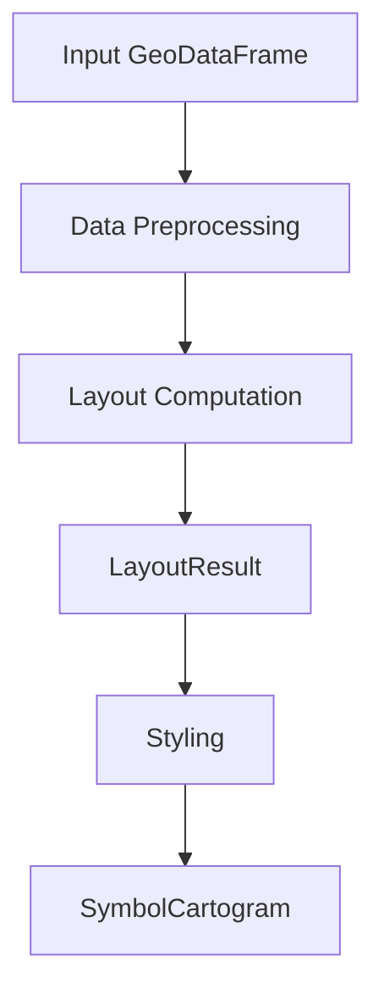

# Symbol Cartogram

Create cartograms where each geographic region is represented by a single symbol.

## Overview

The symbol_cartogram module provides tools for creating Dorling-style cartograms,
tile maps, and other symbol-based visualizations. Each region is represented by
a symbol (circle, square, hexagon, or custom shape) with size proportional to
a data value or uniform.

**Core Concepts**:
- **Layout**: Computation of symbol positions and sizes
- **Styling**: Application of symbol shapes, colors, and transforms
- **Tiling**: Grid-based symbol placement and arrangement



## Main Interface

| Sub-module | Description |
|------------|-------------|
| **[API](api.md)** | Main functions: `create_symbol_cartogram`, `create_layout` |
| **[Layout](layout.md)** | Layout algorithms: `CirclePhysicsLayout`, `GridBasedLayout`, etc. |
| **[LayoutResult](layout_result.md)** | Immutable layout output with transforms |
| **[Result](result.md)** | `SymbolCartogram` result container |
| **[Styling](styling.md)** | Symbol styling configuration |

## Configuration

| Sub-module | Description |
|------------|-------------|
| **[Options](options.md)** | Configuration options for layouts |
| **[Presets](presets.md)** | Pre-configured cartogram styles |

## Symbols and Tiling

| Sub-module | Description |
|------------|-------------|
| **[Symbols](symbols.md)** | Symbol classes: `CircleSymbol`, `HexagonSymbol`, etc. |
| **[Tiling](tiling.md)** | Tiling classes: `HexagonTiling`, `IsohedralTiling`, etc. |

## Computation

| Sub-module | Description |
|------------|-------------|
| **[Placement](placement.md)** | Physics simulators for circle placement |

## Output

| Sub-module | Description |
|------------|-------------|
| **[Visualization](visualization.md)** | Plotting functions |

## Workflow Patterns

### Basic Usage

```python
from carto_flow.symbol_cartogram import create_symbol_cartogram

result = create_symbol_cartogram(gdf, "population")
result.plot(column="population", cmap="Reds")

gdf_result = result.to_geodataframe()
result.save("symbol_cartogram.gpkg")
```

### Layout-Styling Separation

```python
from carto_flow.symbol_cartogram import create_layout

# Compute layout once, experiment with different styles
layout_result = create_layout(gdf, "population", layout="physics")

circle_result = layout_result.style(symbol="circle", scale=1.0)
square_result = layout_result.style(symbol="square", scale=0.8)
hexagon_result = layout_result.style(symbol="hexagon", scale=0.9)
```

### Custom Layout and Styling

```python
from carto_flow.symbol_cartogram import (
    create_symbol_cartogram,
    PhysicsBasedLayout,
    PhysicsSimulatorOptions,
    Styling,
    SymbolShape
)

layout = PhysicsBasedLayout(PhysicsSimulatorOptions(
    spacing=0.15,
    max_iterations=2000,
    force_mode="contact"
))

styling = Styling(symbol=SymbolShape.HEXAGON, scale=0.85, color="#ff6b6b")

result = create_symbol_cartogram(gdf, "population", layout=layout, styling=styling)
```

### Using Presets

```python
from carto_flow.symbol_cartogram import create_symbol_cartogram
from carto_flow.symbol_cartogram.presets import preset_tile_map

result = create_symbol_cartogram(gdf, "population", **preset_tile_map())
result.plot(column="category", categorical=True, cmap="Set3")
```

## Error Handling

| Exception | Description |
|-----------|-------------|
| `ValueError` | Invalid input parameters, missing geometry column |
| `TypeError` | Incorrect parameter types |
| `RuntimeError` | Layout computation failed |
