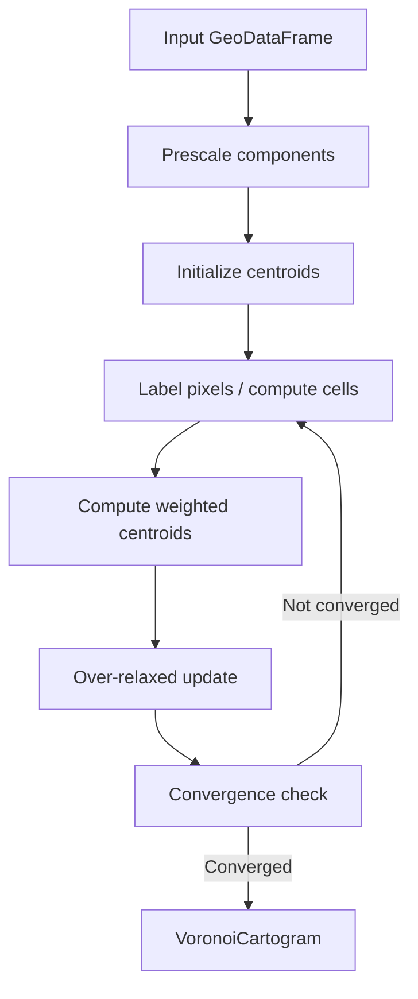

# Voronoi Cartogram

Centroidal Voronoi Tessellation (CVT) cartograms via Lloyd relaxation.

## Overview

The `voronoi_cartogram` module places geometry centroids so that each point
claims an equal-area (or proportionally weighted) Voronoi cell within the
outer union boundary. The result is a set of non-overlapping tiles that
collectively preserve the topology of the input while making cell areas
proportional to a data variable.

**Core Algorithm**: iteratively label pixels by nearest centroid → compute
weighted centroid of each cell → over-relax toward centroid → repeat until
area coefficient of variation drops below tolerance.



## Main Interface

| Sub-module | Description |
|------------|-------------|
| **[API](api.md)** | `create_voronoi_cartogram`, `make_groups_contiguous` |
| **[Options](options.md)** | `VoronoiOptions`, `TopologyRepair` — iteration count, stopping criteria, topology repair schedule |
| **[Backends](backends.md)** | `RasterBackend` (default), `ExactBackend`, `RelaxationSchedule`, `AdhesiveBoundary`, `ElasticBoundary` |
| **[Result](result.md)** | `VoronoiCartogram`, `TopologyAnalysis`, `TopologyRepairReport` — positions, cells, metrics, plot & repair methods |
| **[History](history.md)** | `VoronoiSnapshot` — per-iteration snapshot |

## Computation

| Sub-module | Description |
|------------|-------------|
| **[Field](field.md)** | `BaseField`, `RasterField`, `ExactField` — Lloyd relaxation engines |
| **[Geodesic Labeling](geodesic.md)** | Topology-respecting pixel labeling via multi-source BFS |

## Analysis

| Sub-module | Description |
|------------|-------------|
| **[Contiguity](contiguity.md)** | `make_groups_contiguous` — repair satellite Voronoi cells for grouped regions |

## Output

| Sub-module | Description |
|------------|-------------|
| **[Visualization](visualization.md)** | `plot_cartogram`, `plot_comparison`, `plot_convergence`, `plot_displacement`, `plot_topology`, `plot_topology_repair` |
| **[Animation](animation.md)** | `animate_voronoi_history`, `save_animation` |

## Workflow Patterns

### Basic Voronoi Cartogram

```python
import carto_flow.voronoi_cartogram as vor
import carto_flow.data as examples

us_states = examples.load_us_census(population=True)

result = vor.create_voronoi_cartogram(
    us_states,
    weights="Population (Millions)",
)
result.plot(column="Population (Millions)", legend=True)
```

### Choosing a Backend

```python
# Default: raster nearest-neighbour (10–50× faster than exact)
result = vor.create_voronoi_cartogram(gdf, weights="value")

# Exact scipy Voronoi + shapely clipping (higher accuracy, slower)
result = vor.create_voronoi_cartogram(
    gdf, weights="value",
    backend=vor.ExactBackend(),
)

# Raster with elastic boundary — boundary vertices advected by area pressure
result = vor.create_voronoi_cartogram(
    gdf, weights="value",
    backend=vor.RasterBackend(
        resolution=400,
        boundary=vor.ElasticBoundary(strength=0.3),
    ),
)
```

### Geodesic Labeling

For datasets with complex coastlines or water gaps (where Euclidean
nearest-neighbour would incorrectly assign pixels across bays or straits):

```python
result = vor.create_voronoi_cartogram(
    gdf, weights="value",
    backend=vor.RasterBackend(distance_mode="geodesic"),
)
```

### Topology Repair

When grouped regions (e.g. congressional districts by state) produce
disconnected satellite cells, pass `group_by` to the main call and
call `repair_topology()` on the result:

```python
result = vor.create_voronoi_cartogram(
    gdf, weights="value",
    group_by="state",
)
report = result.repair_topology("state")
result = report.cartogram
print(report.after)
```

### Recording History

```python
# record_history=True captures every iteration; pass an int to subsample
result = vor.create_voronoi_cartogram(
    gdf, weights="value",
    options=vor.VoronoiOptions(record_history=5),  # snapshot every 5 iters
)
for snap in result.history:
    print(f"Iter {snap.iteration}: area_cv={snap.area_cv:.4f}")
```

### Export

```python
gdf_result = result.to_geodataframe()
gdf_result.to_file("voronoi_cartogram.gpkg")
```
